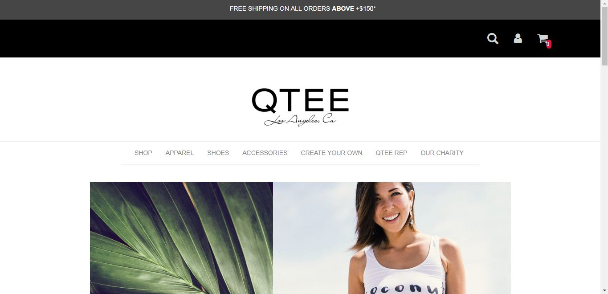

# Qtee
Flexible shopping system buildt with NODEjs-- for upcoming entrepreneurs 
who prefers a flexible system to handle customers requests..

<h1>How it works</h1>

A user comes online... 
He sees a list of available items... 
<i>The user also has the option of shopping by budget 
Where he puts in the amount that he has and  
automatically items that "fits in" to that budget would get returned as results..
</i> 
He "Adds to Cart"('used my vanilla Js cart plugin -- soo cool..') 
Checks out,('where NODEjs comes in') 
He passes the necessary information on check Out.. 
and then this "Information" - which includes:- 
(1). The Purchase Request.. 
(2). The Users Email 
(3). The User's Phone Number 
(4). The User's description of how he wants his delivery handled 
Gets sent as Email ("Used Nodemailer for this -- Used BodyParser to collect the form details") 
to both the site's owner email address and the client.. 

<h2>Running it on your localhost</h2>
$ git clone or download as zip 
$ npm install 
$ npm start

 
 
<h1>Remarks</h1>

In future times, Hope to Extend what NODEjs does on the platform. 
Working on a Shopping System buildt Entirely on NODEjs.. 
When that is done, would release 
the V 2.0 of this project...

<h1>Disclaimer</h1>
This Project is sort of an imitation of QTEE a shopping website 
I kinda "stumbled" on .. 
I loved the design and also its simplicity("User Experience") 
so  i buildt something similar to it..so i take no credit for the my designs beauty beauty 
